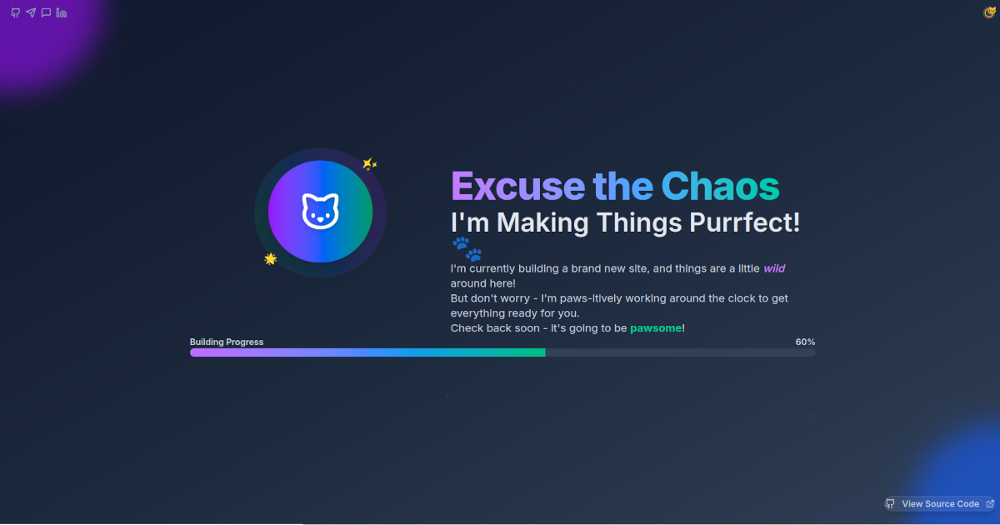

#  PurrfectSpace Under Construction
  
  A simple, customizable "under construction" page with a cat theme for domain parking and temporary site placeholders.
  
  [](https://react.dev/versions)
  [](https://www.typescriptlang.org/docs/handbook/release-notes/typescript-5-8.html)
  [](https://tailwindcss.com/docs/installation/using-vite)
  [](https://github.com/LeonByte/PurrfectSpaceUnderConstruction/releases)
  [](https://opensource.org/licenses/MIT)
  [](https://leonbyte.github.io/PurrfectSpaceUnderConstruction/)

## Overview

When you register a new domain, registrars usually show a generic parking page. This project gives you a better alternative - a clean, customizable page that you control.

**Common use cases:**
- New domains while planning your site
- Temporary placeholder during development  
- Consistent branding across multiple domains
- Alternative to registrar parking pages

  [](https://leonbyte.github.io/PurrfectSpaceUnderConstruction/)
  


## Table of Contents

1. [Overview](#overview)
2. [Quick Setup](#quick-setup)
3. [Multi-Domain Parking Setup](#multi-domain-parking-setup)
4. [Features](#eatures)
5. [Customization](#customization)
6. [Development](#development)
7. [Domain Setup](#domain-setup)
8. [Contributing](#contributing)
9. [License](#license)
10. [Contact](#contact)

## Quick Setup

### Option 1: Fork & Deploy (Recommended)
1. Fork this repository
2. Enable GitHub Pages in repository settings
3. Point your domain to GitHub Pages
4. Customize the content in `src/App.tsx`

### Option 2: Download & Host
1. Run `npm run build` 
2. Upload the `dist` folder to your hosting
3. Point your domain to the hosting

## Multi-Domain Parking Setup

This repository can serve as a parking page for multiple domains simultaneously. Here's how to set it up:

### GitHub Pages Limitation
GitHub Pages only allows **one custom domain** in the repository settings. However, you can point multiple domains to the same GitHub Pages site using DNS configuration.

### DNS Configuration for Additional Domains

**For domains with CNAME support:**
```dns
Type: CNAME
Name: @ (or www)
Value: yourusername.github.io
```

**For apex domains (root domains) use A records:**
```dns
Type: A
Name: @
Value: 185.199.108.153
Value: 185.199.109.153  
Value: 185.199.110.153
Value: 185.199.111.153
```

### Setup Process

1. **Configure the primary domain** in GitHub Pages settings
2. **Point additional domains** using DNS records above
3. **All domains will show** the same maintenance page
4. **Monitor domain status** - all will resolve to your GitHub Pages site

### Moving Domains to Production

When ready to launch a domain with its final site:

1. **Update DNS records** to point to the new hosting
2. **Remove from parking** - no changes needed in this repository
3. **Keep other domains** - they continue showing the maintenance page
4. **Test propagation** - DNS changes may take 24-48 hours

### Benefits of This Approach

- **Centralized management** - update one page, affects all domains
- **Consistent branding** - same professional look across all domains  
- **Zero maintenance** - no individual hosting for each domain
- **Cost effective** - free GitHub Pages hosting
- **Easy transition** - just change DNS when ready to launch

## Features

- **Responsive design** - works on all devices
- **Dark/light mode** - automatic theme switching
- **Contact links** - easily customizable social links
- **Progress animation** - engaging visual element
- **Fast loading** - optimized for quick display

## Customization

Edit `src/App.tsx` to change:
- Your contact information (GitHub, Telegram, etc.)
- The main text and messaging
- Colors and styling
- Progress bar behavior

Most changes only require editing a few lines in the main component.

## Development

```bash
# Install dependencies
npm install
```
```bash
# Start development server  
npm run dev
```
```bash
# Build for production
npm run build
```
```bash
# Deploy to GitHub Pages
npm run deploy
```

### Built With

- React + TypeScript for reliability
- Tailwind CSS for easy styling
- Vite for fast development
- GitHub Actions for automatic deployment

## Domain Setup

### GitHub Pages Setup
1. Go to repository Settings → Pages
2. Select "Deploy from a branch"
3. Choose `main` branch and `/dist` folder
4. Your site will be available at `username.github.io/repository-name`

### Custom Domain
1. Add a `CNAME` file in the `public` folder with your domain
2. Configure DNS to point to GitHub Pages
3. Enable "Enforce HTTPS" in Pages settings

Detailed instructions: [GitHub Pages Custom Domain Guide](https://docs.github.com/en/pages/configuring-a-custom-domain-for-your-github-pages-site)

## Contributing

Found a bug or want to add a feature? Pull requests are welcome! This project aims to stay simple and focused, so new features should enhance the core use case of domain parking.

## License

[MIT LICENSE](LICENSE) - feel free to use this for your own domains and projects.

## Contact

- **GitHub**: [@LeonByte](https://github.com/LeonByte)
- **Telegram**: [@LE0Nbyte](https://t.me/LE0Nbyte)
- **Signal**: [@LeonByte.01](https://signal.me/#eu/MhNhKmpFitQ7EgMlhZjj4Fsa5iUDsjuBC1cVQEq0houuu7EGb8FC0qp5v0768BW-)

---

<div align="center">
  <sub>A practical solution for domain parking 🐾 with a touch of personality. • <a href="#quick-setup">Get Started</a> • <a href="https://github.com/LeonByte/PurrfectSpaceUnderConstruction/issues">Report Bug</a> • <a href="https://github.com/LeonByte/PurrfectSpaceUnderConstruction/issues">Request Feature</a></sub>
</div>

