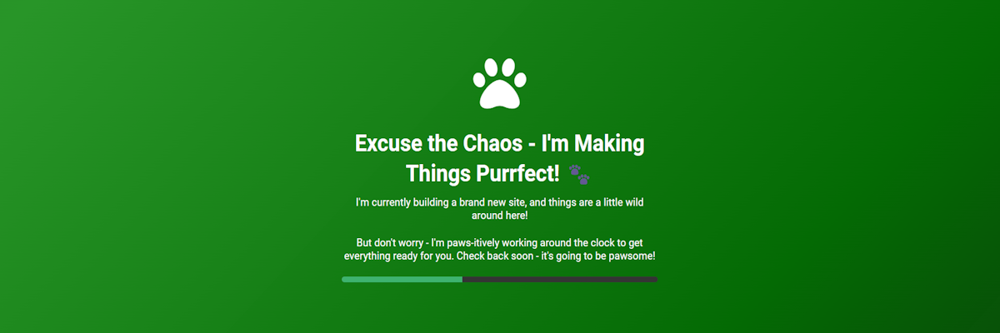

# Building a Purrfect Space: Your Pawsome Hub! - MIT Project

  


A simple, customizable "Under Construction" page designed with a creative gradient background, progress bar animation, and a playful tone. This project is open-source, and anyone is free to contribute or adapt it for their own use.

## Demo

[Live Demo](https://erobert.se)

---

## Table of Contents

1. [Introduction](#introduction)
2. [Features](#features)
3. [Installation](#installation)
4. [Usage](#usage)
5. [Contributing](#contributing)
6. [License](#license)
7. [Links](#links)
8. [Contact](#contact)
9. [Acknowledgments](#acknowledgments)

---

## Introduction

This project is a fun, engaging "Under Construction" webpage. It includes:

This project provides a **fun and engaging "Under Construction" webpage**. It includes a **playful header**, an **animated progress bar**, and a **smooth gradient background**, all designed to entertain users while they wait for the site to go live. The page is fully customizable and responsive, making it an excellent choice for anyone needing a quick way to notify visitors that their site is under construction or in progress.

Whether you're building a personal site, a business landing page, or just need something temporary while you work on a bigger project, this simple yet effective page can help you give visitors something cute and informative to look at!

---

## Features

- **Smooth Gradient Animation**: The background transitions through different shades of green, creating a vibrant, engaging effect.
- **Animated Progress Bar**: The progress bar grows automatically over time to visually indicate the site's development.
- **Responsive Design**: The page is fully responsive, so it looks great on both mobile and desktop devices.
- **Easy Customization**: Update text, change icons, adjust colors, and more in just a few lines of code.
- **MIT License**: Open-source, free to use, modify, or share.

---

## Installation

To get the project up and running locally, follow these simple steps:

1. **Clone the repository**:

   ```bash
   git clone https://github.com/LeonByte/PurrfectSpaceUnderConstruction.git
   ```

2. **Navigate to the project directory**:

   ```bash
   cd PurrfectSpaceUnderConstruction
   ```

3. **Open `index.html`** in your browser:

   - Simply open the `index.html` file in your preferred browser to view the page.

   OR

   You can also run a local server (e.g., using VS Code's live server extension) to view the site in a browser with live-reloading capabilities.

---

## Usage

Once you've got the project running locally, you can easily customize it to fit your needs:

- **Update text**: Edit the `h1` and `p` tags in `index.html` to update the main message or add new text.
- **Change icons**: You can replace the `<i>` tag classes to use any icon from FontAwesome or NerdFonts. This is helpful for personalizing the design with your own style.
- **Modify the progress bar**: The progress bar's animation is controlled by the `script.js` file. By default, the bar increases by 10% every 2 seconds. You can adjust this value, or make the progress bar work based on real-time data, or modify it in any way you wish.
- **Style changes**: The project is fully customizable via CSS. You can edit `style.css` to change the background gradient, colors, fonts, and overall look of the page.
- **Additional functionality**: If you want to expand the project, feel free to add more features like countdown timers, additional animations, or other HTML5 elements to the page.

For more advanced customization, consider adjusting the background gradient, adding more animations, or integrating dynamic elements.

---

## Contributing

We welcome contributions! Here’s how you can help improve the project:

### Bug Fixes and Features

1. **Fork** the repository.
2. **Clone** your fork to your local machine.
3. Create a **new branch** for your feature or bugfix (`git checkout -b feature-name`).
4. **Make your changes** and commit them (`git commit -am 'Add new feature'`).
5. **Push to the branch** (`git push origin feature-name`).
6. **Open a pull request** against the `main` branch.

### Code Style

- Please follow the existing code style for consistency (e.g., indentation, variable naming).
- If you add any new functionality, try to include tests where applicable.

### Reporting Issues

If you find any bugs or have suggestions, feel free to open an **issue** on the repository. Please make sure to provide a clear description of the problem, including any relevant screenshots or code snippets.

---

## License

This project is licensed under the **MIT License** - see the [LICENSE](LICENSE) file for details.

Feel free to fork, use, or modify this project for personal or commercial purposes. Please provide attribution to the original repository.

---

## Links

- **Live Demo**: [View the Under Construction page live on GitHub Pages](https://leonbyte.github.io/PurrfectSpaceUnderConstruction)
- **Personal Website**: [eRobert](https://erobert.se)
- **GitHub Repository**: [https://github.com/LeonByte/PurrfectSpaceUnderConstruction](https://github.com/LeonByte/PurrfectSpaceUnderConstruction)

---

## Contact

- **Author**: [LeonByte](https://github.com/LeonByte)
- **Telegram**: [@LE0Nbyte](https://t.me/LE0Nbyte)
- **Signal**: [@LeonByte.01](https://signal.me/#eu/MhNhKmpFitQ7EgMlhZjj4Fsa5iUDsjuBC1cVQEq0houuu7EGb8FC0qp5v0768BW-)

Feel free to reach out if you have any questions, suggestions, or if you'd just like to say "hi"!

---

## Acknowledgments

- **FontAwesome**: For providing high-quality icons.
- **Nerd Fonts**: For offering extended icon sets, including useful symbols for developers.
- **Google Fonts**: For providing beautiful, open-source fonts.
- **W3C**: For HTML5 and CSS3 specifications.
- **MIT License**: For making this project open-source.

---
